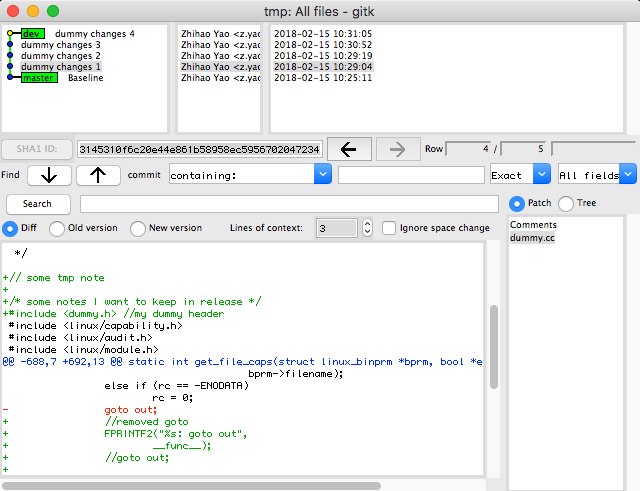
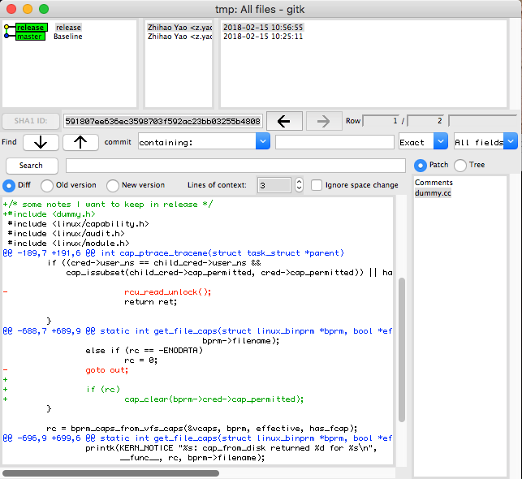

Copyright (c) 2018 Zhihao Yao (z.yao@uci.edu)
*This program is shared under the GNU General Public License WITHOUT ANY WARRANTY. See the GNU General Public License for more details.*

Diffbot generates a git patch with debug messages removed.
Line number are automatically re-calculated.

##Usage
Assume you worked on the `master` branch of an open source project, and now you are on `dev` branch.
You want to publish all your changes as a big commit on top of `master` branch, without the comments and debug prints you have added. 



```sh
git diff master dev &> ~/dummy.diff
python <PATH>/main.py -i ~/dummy.diff &> ~/dummy_OUT.diff
git checkout master
git apply ~/dummy_OUT.diff
git checkout -b release
git add .
git commit -a -m "release"
git push origin release
```



Note: diffbot works with Python 2

##Code Example

###C/C++ code
```diff
  /* block comment will not be removed
   *
   */ /*long or short*/
 		case VGT_REG_CFG_SPACE_BAR2:	/* IO */
-			//author
-			PRINTK4("[3]: VGT_REG_CFG_SPACE_BAR%s\n",
-			((off & ~3) ==  VGT_REG_CFG_SPACE_BAR0 ? "0":
-			((off & ~3) ==  VGT_REG_CFG_SPACE_BAR1 ? "1" : "2")));
- pid = getpid(); //// vmid
+ pid = getpid();
- //author
- FPRINTF2("%s[0]success", __func__);
- return; //this is an early return
+ return;
```
diffbot removes comments, either it is a whole line or part of the line.

###`//` in string
```c
  sed "s| $$srcdirstrip/| |;"' / .*\//!s/ .*/ ./; s,\( .*\)/[^/]*$$,\1,' | \ 
```
diffbot handles `//` in string correctly.

###Non C/C++ code
```diff
- #comments
  echo helloworld
```
diffbot removes `#` and ignores `dnl`.

###Exception
```diff
ERROR: You should not code this way
+	if (local_addr < 0xf6000000 || local_addr >= 0xf7000000)
+		PRINTK_ERR("Error: PTE is NULL (local_addr = %#lx, state = %d)\n",
```
diffbot prints an error message if certain problematic code is found `CHECK_IF_PREVIOUS_NEW_LINE_HEADLESS`.

Note: diffbot might not catch all cases. TODO: automatically removal

```c
PRINTF("something");   return;
```

diffbot will remove the whole line in the example above. `ASSERT_NO_NEW_LINE_CONCATENATED` is buggy (TODO: automatically remove the print part). 